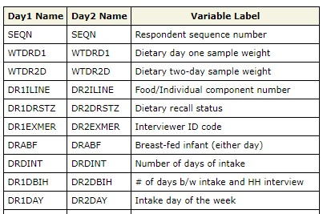
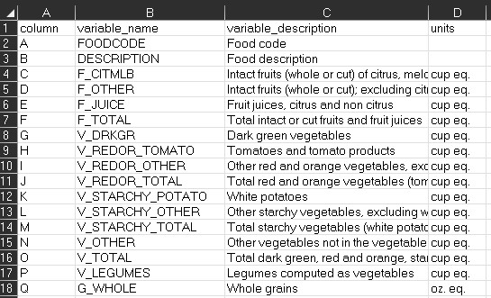

Name the path to DietR directory where input files are pulled.
```{r}
  main_wd <- "~/GitHub/DietR"
```

Load the necessary packages.
```{r}
library(SASxport)
```

Load the necessary functions.
```{r}
  source("lib/specify_data_dir.R")
  source("lib/load_clean_NHANES.R")
  source("lib/load_clean_ASA24.R")
```

You can come back to the main directory by:
```{r, eval=FALSE}
  setwd(main_wd)
```

<br>

## QC the formatted food data by their demographics data

### Download and prepare demographics data

Download demographics data (DEMO_I.XPT) from NHANES website. Name the file and destination. `mod="wb"` is needed for Windows OS; other OS users may need to delete it.
```{r, eval=FALSE}
download.file("https://wwwn.cdc.gov/Nchs/Nhanes/2015-2016/DEMO_I.XPT", 
              destfile= "eg_data/NHANES/DR1IFF_I.XPT", mode="wb")
```

Load the demographics file.
```{r}
demog <- read.xport("eg_data/NHANES/Raw_data/DEMO_I.XPT")
```

Demographics data has the age, gender, etc. of each participant. Read [the documentation on demographics](https://wwwn.cdc.gov/Nchs/Nhanes/2015-2016/DEMO_I.htm) for details.
```{r}
head(demog, 1)
```

Only take the data of adults (18 years of age or older).
```{r}
adults <- demog[demog$RIDAGEYR >= 18, ]
```

Check the number of adults - should be 5,992.
```{r}
length(unique(adults$SEQN)) 
```

<br>

### Load the formatted food items data and filter by age, completeness, >1 food item reported/day, data exists on both days

Load the formatted food data prepared in the previous section.
```{r}
Food_D1_FC_cc_f <- read.table("eg_data/NHANES/Food_D1_FC_cc_f.txt", sep="\t", header=T)
Food_D2_FC_cc_f <- read.table("eg_data/NHANES/Food_D2_FC_cc_f.txt", sep="\t", header=T)
```

Check the number of complete and incomplete data or each day. According to [the documentation on food items](https://wwwn.cdc.gov/Nchs/Nhanes/2015-2016/DR1IFF_I.htm), value 4 is incomplete. By looking at the DRxDRSTZ column, 2,208 rows are marked incomplete for Day 1, and 1,902 rows for Day 2.
```{r}
table(Food_D1_FC_cc_f$DR1DRSTZ) # Day 1
table(Food_D2_FC_cc_f$DR2DRSTZ) # Day 2
```

Subset only those with complete data (STZ==1).
```{r}
food1 <- subset(Food_D1_FC_cc_f, DR1DRSTZ == 1)
food2 <- subset(Food_D2_FC_cc_f, DR2DRSTZ == 1)
```

Create a vector of SEQN of those who reported data for both days and are adults.
```{r}
food1names <- unique(food1$SEQN) # 8,326 adults
food2names <- unique(food2$SEQN) # 6,875 adults
keepnames <- food1names[food1names %in% food2names]  # 6,863
keepnames_adults <- keepnames[keepnames %in% adults$SEQN] # 4,405
```

Keep those who reported more than 1 food item per day.
```{r}
freqtable1 <- as.data.frame(table(food1$SEQN))
freqtable1_m <- freqtable1[freqtable1$Freq > 1, ]
colnames(freqtable1_m)[1] <- "SEQN"
keepnames_adults_mult1 <- keepnames_adults[keepnames_adults %in% freqtable1_m$SEQN] # 4,405
```

Take only the participants whose names are in keepnames_adults_mult1.
```{r}
food1b <- food1[food1$SEQN %in% keepnames_adults_mult1, ] # 66,304 rows
```

Do the same for food2.
```{r}
freqtable2 <- as.data.frame(table(food2$SEQN))
freqtable2_m <- freqtable2[freqtable2$Freq > 1, ]
colnames(freqtable2_m)[1] <- "SEQN"
keepnames_adults_mult2 <- keepnames_adults[keepnames_adults %in% freqtable2_m$SEQN] # 4,401
food2b <- food2[food2$SEQN %in% keepnames_adults_mult2, ] # 66,690 rows
```

Create a vector of SEQN of those that have both day 1 and day 2 data.
```{r}
food1bnames <- unique(food1b$SEQN)
food2bnames <- unique(food2b$SEQN)
keepnames12 <- food1bnames[food1bnames %in% food2bnames] 
```

Check the number of participants remained. 4,401 people met the criteria.
```{r}
length(keepnames12)
```

<br>

## Prepare food data for food tree and generate totals

Choose Scenario A or B. (B consists of B-1, B-2, B-3, and B-4.)\
**Scenario A**: Further process food1b and food2b for building a food tree \
**Scenario B-1-4**: Calculate totals from the QC-ed food items and QC totals\

### **Scenario A**: Further process food1b and food2b for building a food tree

Make a day variable to distinguish them.
```{r}
food1b$Day <- 1
food2b$Day <- 2
```

Copy these datasets to avoid overwriting.
```{r}
food1e <- food1b
food2e <- food2b
```

Remove the prefixes "DR1I", "DR1" from the columnnames.
```{r}
colnames(food1e) <- gsub(colnames(food1e), pattern = "^DR1I", replacement = "")
colnames(food1e) <- gsub(colnames(food1e), pattern = "^DR1",  replacement = "")
colnames(food2e) <- gsub(colnames(food2e), pattern = "^DR2I", replacement = "")
colnames(food2e) <- gsub(colnames(food2e), pattern = "^DR2",  replacement = "")
```

Ensure the columns of food1c and food2c match before joining them.
```{r}
identical(colnames(food1e), colnames(food2e))
```
  
Combine food1 and food2 as a longtable (add food2 rows after food1 rows).
```{r}
food12e <- rbind(food1e, food2e)
```

Select only the individuals listed in keepnames12.
```{r}
food12f <- food12e[food12e$SEQN %in% keepnames12, ]
```

Save as a .txt. It will be a HUGE file. Use this as an input for **food tree**.
```{r}
write.table(food12f, "eg_data/NHANES/Food_D12_FC_cc_f_s.txt", sep="\t", row.names=F, quote=F)
```

Add the demographic data to food12f for data overview.
```{r}
food12f_d <- merge(x=food12f, y=demog, by="SEQN", all.x=T)
```

Save. It will be a HUGE file. Use this as an input for **data overview**.
```{r}
write.table(food12f_d, "eg_data/NHANES/Food_D12_FC_cc_f_s_d.txt", sep="\t", row.names=F, quote=F)
```

<br>

### **Scenario B-1-4**: Calculate totals from the QC-ed food items and QC totals

#### Scenario B-1: Further processing of food1b and food2b for calculating totals and clustering  

Copy datasets to avoid overwriting.
```{r}
food1bb <- food1b
food2bb <- food2b
```

Change "FoodAmt" back to "DR1GRMS" to be consistent with the variable names in dayXvariables
```{r}
names(food1bb)[names(food1bb) == "FoodAmt"] <- "DR1IGRMS"
names(food2bb)[names(food2bb) == "FoodAmt"] <- "DR2IGRMS"
```

**[NOTE]** Prepare data to combine day 1 and day 2 data.

Appendix 2 of [food data documentation](https://wwwn.cdc.gov/Nchs/Nhanes/2015-2016/DRXFCD_I.htm#Appendix_2._Variables_in_the_Individual_Foods_Files_(DR1IFF_I_and_DR2IFF_I)_by_Position) shows the variables in the Individual Foods Files (DR1IFF_I and DR2IFF_I).



However, we need food category information as well, similar to ASA24. Food category variables (Food Patterns Equivalents Database per 100 grams of FNDDS) can be found in [the FPED page](https://www.ars.usda.gov/northeast-area/beltsville-md-bhnrc/beltsville-human-nutrition-research-center/food-surveys-research-group/docs/fped-databases/). Select the same years of FPED as your NHANES release you are using. The variable labels (F_CITMLB through A_DRINKS, for FPED 2015-2016) are the food category variables you need.

```{r, echo=FALSE, fig.align = 'left', out.width = "60%", fig.cap = "The first few lines of FPED_1516.xls"}

```

If you are analyzing NHANES 2015-2016, this tutorial provides you with a .txt file with the necessary variable names  that can be found in the “Food_VarNames” folder. If you are analyzing other releases of NHANES, create an Excel workbook, and copy and paste the variables from the Appendix of the documentation of the selected version of NHANES and food category variables from the appropriate version of FPED.

Those two sets of variables need to come one after another vertically, so that they will form a long list of variables, for which we would like to calculate totals from the food data. 

<br>

---

Import the list of variables to be selected in Day 1.
```{r}
day1variables <- read.table('eg_data/NHANES/Food_VarNames/NHANES_Food_VarNames_FC_Day1.txt', header=F)
```

Select the variables to pick up from the food data.
```{r}
var_to_use1 <- names(food1bb) %in% day1variables$V1
```

Pick up only the specified variables.
```{r}
food1c <- food1bb[, var_to_use1]
```

Remove "DR1T", "DR1" from the column names.
```{r}
colnames(food1c) <- gsub(colnames(food1c), pattern = "^DR1I", replacement = "")
colnames(food1c) <- gsub(colnames(food1c), pattern = "^DR1",  replacement = "")
```

Check the column names.
```{r, eval=FALSE}
colnames(food1c)
```

<details>
  <summary>Click to expand output</summary>
```{r, echo=FALSE, eval=TRUE}
colnames(food1c)
```
</details>

<br>

---

Do the same for Day 2.
```{r}
day2variables <- read.table('eg_data/NHANES/Food_VarNames/NHANES_Food_VarNames_FC_Day2.txt', header=F)
var_to_use2 <- names(food2bb) %in% day2variables$V1
food2c <- food2bb[, var_to_use2]
colnames(food2c) <- gsub(colnames(food2c), pattern = "^DR2I", replacement = "")
colnames(food2c) <- gsub(colnames(food2c), pattern = "^DR2", replacement = "")
```

Make a day variable before combining food1c and food2c.
```{r}
food1c$Day <- 1
food2c$Day <- 2
```

Ensure the columns of food1c and food2c match before joining them.
```{r}
identical(colnames(food1c), colnames(food2c))
```

If not, create a table that has the column names of both food1c and food2c, examine the column names side-by-side.

```{r, eval=FALSE}
names <- data.frame(matrix(nrow= max(ncol(food1c), ncol(food2c)), ncol=2))
colnames(names) <- c("food1c", "food2c")
names$food1c <- colnames(food1c)
names$food2c <- colnames(food2c)
names
```

Combine food1 and food2 as a longtable.
```{r}
food12c <- rbind(food1c, food2c)
```
  
Pick up only the individuals listed in keepnames12.
```{r}
food12d <- food12c[food12c$SEQN %in% keepnames12, ]
```

Save the combined and QC-ed food items as a .txt file. 
This has nutrient information, food categories, and day variable for each food item reported, and shall be used to calculate totals in B-2. *** THIS WILL BE A HUGE FILE. ***
```{r}
write.table(food12d, "eg_data/NHANES/Food_D12_FC_QC.txt", sep="\t", quote=F, row.names=F)  
```

---

You may also want to consider special diets that some participants are following: e.g. DASH diet, diabetic diet, etc. Depending on your research question, you may want to exclude those following special diets. The diet information is found in totals day 1. We will revisit diet information in the next section.

<br>

#### B-2: Calculate totals/day/participant with the food data of the selected SEQN

Load the QC-ed food items.
```{r}
food12d <- read.table("eg_data/NHANES/Food_D12_FC_QC.txt", sep="\t", header=T)
```

Calculate totals for day 1 and day 2, and combine the two datasets.
```{r}
  TotalNHANES(food12d= food12d, 
              first.val= "GRMS", last.val= "A_DRINKS", 
              outfn= "eg_data/NHANES/Total_D12_FC_QC_eachday.txt") 
```

Load the resultant total.
```{r}
total12d <- read.table("eg_data/NHANES/Total_D12_FC_QC_eachday.txt", sep="\t", header=T)
```

`total12d` has the sum of each variable (columns) for each day and participant.
```{r, eval=FALSE}
head(total12d, 2)
```

<details>
  <summary>Click to expand output</summary>
```{r, echo=FALSE, eval=TRUE}
head(total12d, 2)
```
</details>

<br>

#### B-3: Calculate the mean of totals/participant

Calculate the mean of the two days of the totals data per participant.
```{r}
AverageTotalNHANES(food12d= food12d, 
                   first.val= "GRMS", last.val= "NoOfItems", 
                   outfn= "eg_data/NHANES/Total_D12_FC_QC_mean.txt")  
```

Load the mean totals.
```{r}
meantotal12b <- read.table("eg_data/NHANES/Total_D12_FC_QC_mean.txt", sep="\t", header=T)
```

<br>

#### B-4: QC the mean total in the same way as ASA24. 

For individual food data, there is no code for cleaning. Outliers won't severely affect main analysis conclusions according to ASA24 data cleaning doc. However, it is always a good practice to take a look at the distributions of variables of interest. You can calculate totals by occasion, similarly to what we did with the ASA24 data.
  
For totals, the same QC can be applied as ASA24 totals QC procedure.

Run all these QC steps in this order.  When asked, choose to remove the outliers that fall outside the specified range for each nutrient.

Define the input data.  This dataframe will be modified after each filter.
```{r}
QCtotals <- meantotal12b
```

Flag if KCAL is <600 or >5700 &rarr; ask remove or not &rarr; if yes, remove those rows.
```{r}
QCOutliers(input.data = QCtotals, 
           target.colname = "KCAL", min = 600, max = 5700)
```

Flag if PROT is <10 or >240 &rarr; ask remove or not &rarr; if yes, remove those rows.
```{r}
QCOutliers(input.data = QCtotals, 
           target.colname = "PROT", min = 10, max = 240)
```

Flag if TFAT is <15 or >230 &rarr; ask remove or not &rarr; if yes, remove those rows.
```{r}
QCOutliers(input.data = QCtotals, 
           target.colname = "TFAT", min = 15, max = 230)
```

Flag if VC (Vitamin C) is <5 or >400 &rarr; ask remove or not &rarr; if yes, remove those rows.
```{r}
QCOutliers(input.data = QCtotals,  
           target.colname = "VC", min = 5, max = 400)
```

or show the outliers if too many.
```{r}
  VCoutliers <- Outlier_rows[, c('SEQN', 'KCAL', 'VC')]
  # Show the first n rows of the outliers in descending order. 
  head(VCoutliers[order(VCoutliers$VC, decreasing = T), ], n=10)
```

Look at how many rows (observations) were kept after QC.
```{r}
dim(QCtotals)
```
      
---

Save QCed total as a .txt file.
```{r}
write.table(QCtotals, "eg_data/NHANES/Total_D12_FC_QC_mean_QC.txt", sep="\t", quote=F, row.names=F)
```

<br>

---

Add demograhic data to the QC-ed total.

Load the demographics file if you have not done so yet.
```{r}
demog <- read.xport("eg_data/NHANES/Raw_data/DEMO_I.XPT")
```

Merge QC-totals and demographics by SEQN.
```{r}
QCtotals_d <- merge(x=QCtotals, y=demog, by="SEQN", all.x=TRUE)
```

Save QCtotal_d as a .txt file.
```{r}
write.table(QCtotals_d, "eg_data/NHANES/Total_D12_FC_QC_mean_QC_d.txt", sep="\t", quote=F, row.names=F)
```

