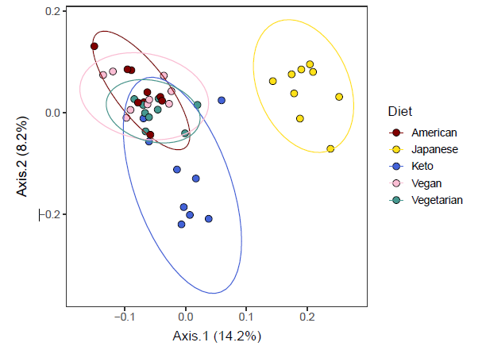

<style type="text/css">

body{ /* Normal  */
  color: #3c3c3c;
  background-color: lightblue;
<!-- td {  /* Table  */ -->
<!--   font-size: 8px; -->
}
h1.title {
  font-size: 38px;
  font-family: "Tahoma", sans-serif;
  color: DarkSlateGray;
}
h1 { /* Header 1 */
  font-size: 28px;
  color: DarkGreen;
}
h2 { /* Header 2 */
    font-size: 22px;
  color: DarkGreen;
}
h3 { /* Header 3 */
  font-size: 18px;
  color: DarkGreen;
}

<!-- code.r{ /* Code block */ -->
<!--     font-size: 12px; -->
<!-- } -->
<!-- pre { /* Code block - determines code spacing between lines */ -->
<!--     font-size: 14px; -->
<!-- } -->
</style>

# First level header

**Note**
This is a note section. 

## Second level header

**Warning**
This is a warning section.  

<br>


### third level header

<br>

# Another first level header
## How to insert arrow symbols
Flag if VC (Vitamin C) is <5 or >400 &rarr; then, ...
<br>

**[NOTES in bold]**
<br>

## Color text
<span style="color: red;">text in color</span>
<br>

## Block quote

> "If it weren't for my lawyer, I'd still be in prison.
>  It went a lot faster with two people digging."

## Curly brackets
The number of rows should be {No. of users x No. days}. 

## Change to a new line in a long text.
This sentence is followed by two trailing spaces.  
Hit return. Now these two should appear in two separate lines.
<br>

## Table

Relevant variables here include: 

Variable | Description
--------- | ---------------------------------
BMDSTATS | Body Measures Component Status Code:
          | 1 == Complete data for age group
          | 2 ==	Partial: Only height and weight obtained
BMXHT    | Standing Height (cm)
BMIHT    | Standing Height Comment
BMXBMI   | Body Mass Index (kg/m^2^)

## Lists
Numbered list

1. Build a foodtree with food items reported by VVKAJ study participants.
2. Generate OTU tables from the taxonomy information of reported food items.

## Insert a PDF as an image

?????

<br>

---

## Insert an image

Just type "![my image caption](" and press the tab key - it will show you potential images to be inserted. Handy!



## R code chunks
### Chunk names must be unique - should be no duplications.
```{r Name of this chunk, echo=FALSE}
# echo=FALSE
aaaa <- 5 + 2
aaaa
```

```{r Chunk2, eval=FALSE}
# eval=FALSE
evalFALSE <- 1 + 2
evalFALSE
```

<!-- This is to remove big white space at the end of the rendered html, which is produced due to toc_floating.  Source: https://stackoverflow.com/questions/52933437/how-to-remove-white-space-at-the-end-of-an-rmarkdown-html-output -->
<div class="tocify-extend-page" data-unique="tocify-extend-page" style="height: 0;"></div>


