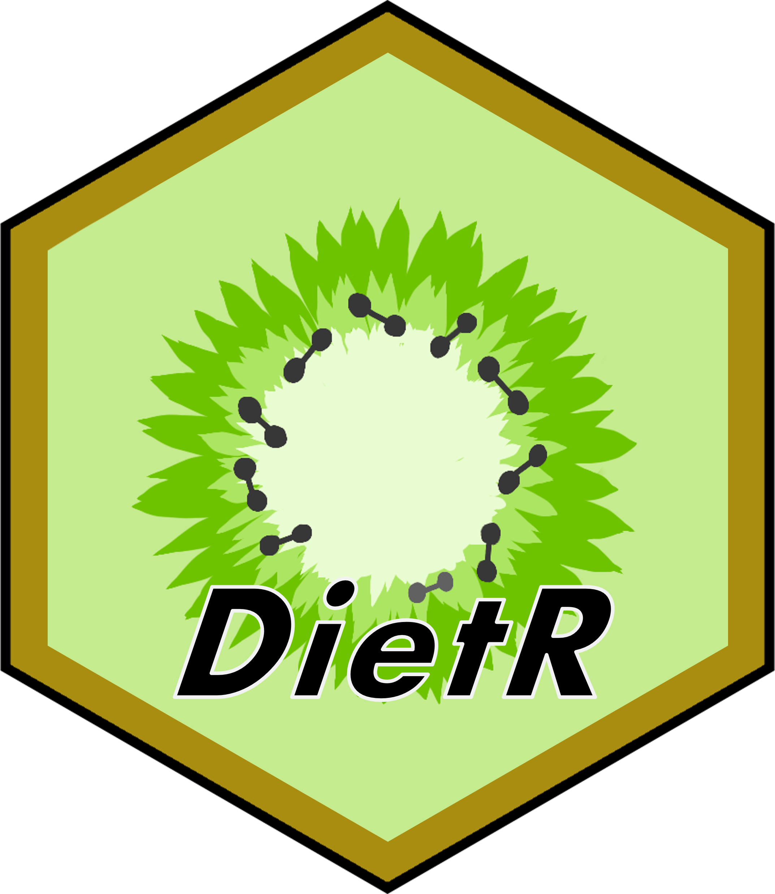

# **Welcome to DietR package tutorial**

This tutorial shows how to analyze ASA24 and NHANES data.

### Get started

1. Download the [whole repository of DietR](https://github.com/computational-nutrition-lab/DietR). It contains files and scripts used in this tutorial.

2. The easiest way to follow along this tutorial is to create "documents/Github" folder in your home directory and bring unzipped DietR repository there, so that you can run tutorial codes without modifying paths.

3. See the [links page](https://computational-nutrition-lab.github.io/DietR_gh_pages/Links.html) for additional resources for using R.

### [Computational Nutrition Lab](https://github.com/computational-nutrition-lab)

